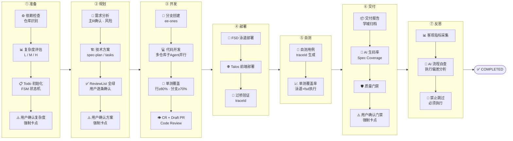
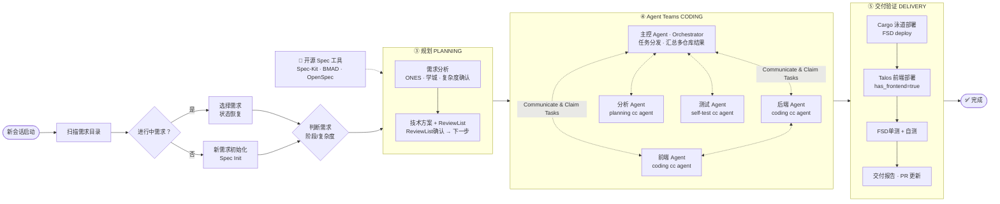
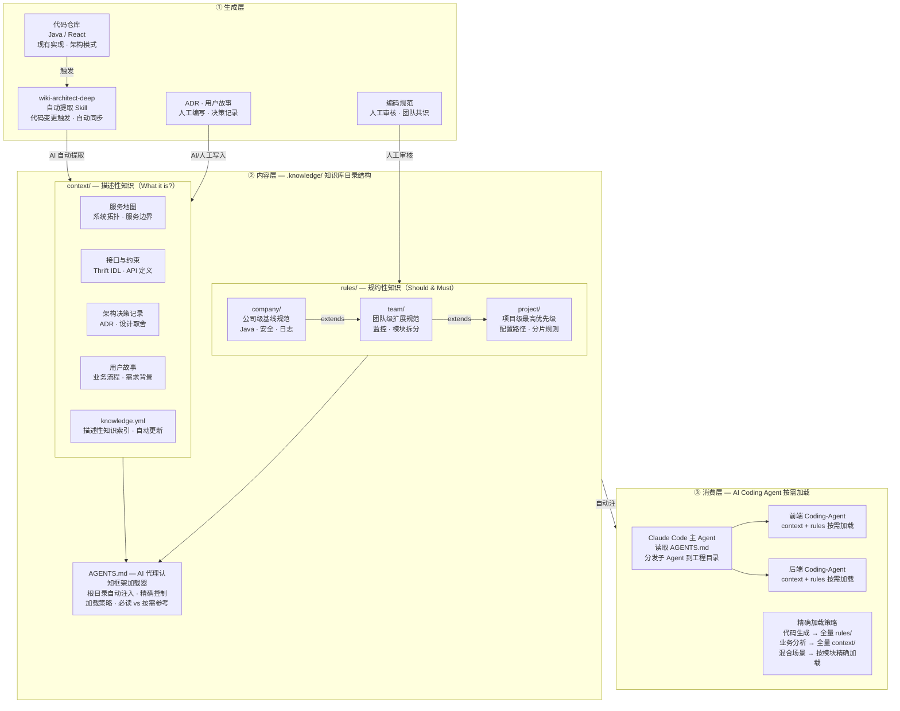

# 全栈交付AI Coding实践 — 全栈范式下的 Harness Engineering

**全栈 AI Coding 不是「前端 AI + 后端 AI」的简单叠加，而是一个需要重新设计协作范式的工程问题。**

如何用 Harness Engineering 的思路在全栈AI Coding范式下探索：「状态持久化、信息分层、强制约束、上下文隔离」——把全栈 AI Coding的执行路径约束在正确轨道上。

全栈场景是 Harness Engineering 价值最集中的地方。Harness 的作用是**在问题暴露之前就把边界约束好**：让 AI 看见正确的上下文、按照正确的顺序推进、在关键节点等待人的确认。没有 Harness，全栈 AI Coding 的复杂度会随着工程数量指数级增长；有了 Harness，全栈场景AI Coding复杂度被分解成可管理的边界问题。

## 一、背景：全栈场景下跨仓库AI Coding交付的痛点

单仓库单工程，AI Coding 的体感通常是好的。但全栈场景不一样——它不是"前端 + 后端"的简单叠加，而是**两套独立的上下文、两条工具链、两条部署路径同时运转**，任何一个环节的假设出错，都会在另一个工程里放大。

AI 的根本性弱点在这里暴露得最明显：**它不会主动停下来问**。前端 AI 看不到后端 Thrift 接口的实际定义，它只能假设一个参数结构然后继续写；后端 AI 不知道前端组件的版本约束，它生成的枚举值顺序可能和前端渲染逻辑对不上。

这次实践想验证的问题是：**在全栈跨仓库场景下，用 Harness 约束住 AI，能不能把这类问题控制住**。Harness 的核心思路——把架构约束、上下文信息、流程边界工程化——在全栈场景下是否依然有效，还是会因为复杂度上升而失控。

具体体现在4个痛点：

| 痛点 | 具体表现 |
|---|---|
| 没有「前置动作」意识 | 需求没分析清楚就开始写代码，反复返工 |
| 没有状态管理 | 跨对话时 AI 完全失忆，新对话要把上下文重新喂一遍 |
| 没有质量门禁 | 代码写完就算交付，没有单测、没有 Code Review、没有准出标准 |
| 全栈场景更混乱 | 前后端是两个工程、两套命令、两条部署链路，单靠一个对话根本驾驭不了 |

全栈交付AI Coding实践 针对的就是这几个问题。它的定位不是「更好的提示词」，而是一套有状态、有强制约束的 Harness——把 AI 的执行路径限制在正确的轨道上，防止它在长流程里悄悄跑偏。**流程工具，不是编码工具**，这个区别决定了你应该在什么时候用它。

## 二、全栈AI Coding 研发交付流程 Harness 设计



Harness Engineering 的核心思路是：**不靠提示词说服 AI，靠工程约束让 AI 没有机会跑偏**。这套 AI Coding流程 的设计也是这个逻辑——它的三个核心机制，分别对应 Harness 的三个支柱：Context Engineering（让 AI 看见正确信息）、Architectural Constraints（确定性约束）、Entropy Management（防止流程腐败）。

### 2.1 状态持久化：让流程在跨对话的时间跨度里保持连贯

AI 对话本质上是无状态的——每次新开对话，AI 对上一次做了什么一无所知。当一个的需求横跨多天，如果没有任何状态持久化机制，每次开对话都要重新交代上下文，不只是体验差，更大的风险是**乱序执行**：跳过关键阶段、重复已完成的工作、在错误的状态上继续推进。

这套流程的解法是把「当前执行到哪了」写进工程目录里的状态文件，新对话启动时第一件事就是读这个文件，从上次中断的地方接着走。**流程的可靠性不依赖 AI 的记忆，而依赖文件系统的持久化**——这是 Entropy Management 的核心：防止长流程在时间跨度里腐败。

### 2.2 信息分层加载：保持有效的上下文窗口

一个完整需求包含阶段的交付流程，如果把所有阶段的说明、规范、约束全部塞进每个对话，AI 用于分析代码和生成内容的空间就会被严重压缩，生码质量会随着 context 增长而下降。

这套流程的设计是**主控框架常驻，阶段内容按需加载**——当前阶段的子规范在进入该阶段时才加载进来，用完即卸。AI 在任何时刻只看到当前阶段需要的信息，不多也不少。这是 Context Engineering 的渐进式披露原则：**精确投喂比大量投喂更有效**。

### 2.3 复杂度分级：不同规模的需求走不同深度的流程

并非所有需求都需要同等深度的流程。一个 2pd 的小改动如果也要走完整的 Spec-Kit，是过度工程化；一个 15pd 的复杂需求如果跳过技术规格直接编码，风险极高。**复杂度分级（L/M/H）的本质是剪枝**——让流程的深度和需求的规模匹配，不浪费，也不冒进。

|  | 复杂度 | 工作量参考 | Spec 阶段 | 文档产出 |
|---|---|---|---|---|
| 1 | L（轻量） | ≤5pd | 全程跳过 spec | 9类文档 |
| 2 | M（中等） | 5-15pd | spec-specify + spec-plan | 12类文档 |
| 3 | H（复杂） | >15pd | 完整 spec + tasks 任务清单 | 13类文档 |

### 2.4 强制约束：软指导在长流程里会失效

文字层面的"建议"在长 context 下几乎无效——AI 会在推进过程中悄悄绕过它。**约束要起作用，必须是硬阻断**：违反约束时流程直接停止，而不是发出警告后继续走。这不是告诉 AI 不要这样做，而是让它物理上做不到。

这套流程定义了全局红线（跨会话强制确认复杂度、强制新建分支、质量门禁不可绕过、多仓库必须 Agent Teams 并行等），任何阶段均适用。红线的存在不是为了限制灵活性，而是**把那些「一旦跳过就会在后面付出代价」的节点，变成不可绕过的检查点**。

### 2.5 上下文隔离：跨仓库场景下的 Agent Teams 分工

全栈场景的核心问题之一是 context 爆炸：前后端两个工程虽然在同一个 Workspace 下，但如果主 Agent 串行读取两套代码库，上下文窗口会快速填满，生码质量随之下降。信息不加隔离地混在一起，AI 也更容易在两个工程之间产生错误的关联假设。

解法是 ***主动的上下文隔离，跨仓库场景下利用Agent Teams协作机制*** ：Team Lead 为前端工程和后端工程各自启动独立的队友（Teammate），指定各自的工程目录作为工作边界。与 Subagent 模式（只能单向汇报给调用方）不同，Agent Teams 的队友之间**可以直接通信**——前端队友发现接口变更时，可以直接向后端队友发送消息协商对齐，无需经过 Team Lead 中转；各队友也共享同一份任务列表，完成任务后可自主认领后续工作，Team Lead 无需全程盯梢每一步。Team Lead 的职责是任务分配、进度协调和最终的跨工程决策，而不是充当信息传递的中间层。**队友间的直接通信让跨工程的对齐成本大幅降低，Team Lead 得以专注在协调层而非信息搬运上**——这是 Agent Teams 相比 Subagent 模式最核心的架构差异。

这是空间 Scaling 的实践：**多个 Agent 并行时，分工明确、边界清晰、队友自治，才能收敛**。

### 2.6 文档体系：每次交付都在为 Harness 建设 Context

**这套 Harness 设计的核心逻辑**

状态持久化解决时间跨度问题；信息分层加载解决上下文稀缺问题；强制约束解决软指导失效问题；上下文隔离解决跨仓库 context 爆炸问题；文档体系解决知识积累和复用问题。五个机制各自针对一个具体的工程问题，叠加起来才构成一套在全栈跨仓库场景下可信赖的 Harness。

在 AI Coding 交付过程中文档产物不只是交付的副产品，它们是这套 Harness Engineering 的 Context 层——下一次需求启动时，文档产物会作为上下文给 AI Coding 做输入。

```Markdown
{需求名称}/
├── 01-需求分析文档         ← 需求分析阶段，AI 从 ONES 工作项提取
├── 02-技术方案概览         ← 方案阶段
├── 03-技术方案详细设计     ← 方案阶段（M/H）
├── 04-测试用例             ← 与技术方案同步生成
├── 05-上线计划checklist    ← 部署步骤 + 回滚预案
├── 06-API文档              ← 接口定义（M/H）
├── 07-开发ReviewList       ← 人工确认全绿才能进入编码
├── 08-spec原始文件         ← AI 推理过程留存（M/H）
├── 10-单元测试报告         ← 单测阶段
├── 11-cargo部署记录        ← 部署阶段
├── 12-自测用例             ← 自测阶段
├── 14-交付报告             ← 自动生成，汇总所有阶段结果
└── 15-准出风险分析报告     ← 质量门禁输出
```

**「07-开发ReviewList」 是整个流程里最重要的人机协作节点**：这是规划阶段到编码阶段的唯一出口，所有检查项全部确认之后，流程才会推进到编码阶段。它的作用是把「技术决策」和「开始动手」之间强制隔开一道人工确认——在这里发现问题，改一个字段的成本是零；等代码写完再改，代价翻几倍。

## 三、全栈交付 SKILL 的设计建设与知识库探索

**全栈交付 SKILL：** 作为一套覆盖全栈需求交付全流程的 Claude Code SKILL，集成了内部工具链（构建、发布、部署、CODE 等），把从需求分析到上线部署阶段串联成一套有状态、有约束的自动化流程。

一套能在全栈跨仓库场景下可靠运转的 SKILL，不只是一个提示词文件。它需要解决三个层面的问题：**流程怎么组织**（让 AI 按正确顺序推进）、**知识怎么沉淀**（让 AI 每次都能看到正确的上下文）、**工具怎么接入**（让 AI 能真正执行而不只是生成文字）。



### 3.1 SKILL 的层次结构

全栈AI Coding交付SKILL 的结构是三层：

- **主控层**（SKILL.md）：常驻在 Claude Code 的上下文里，负责两件事——读写状态文件（当前执行到哪个阶段、哪些阶段已完成）和阶段调度（判断下一步该进入哪个子 skill）。它不包含任何具体的执行逻辑，只负责「流程在哪里」这一件事。
- **阶段层**（各子 skill 文件）：每个交付阶段（需求分析、技术方案、编码、单测、部署等）对应一个独立的子 skill 文件，包含该阶段的执行规范、约束条件、产物要求。进入该阶段时加载，完成后卸载。这样主 Agent 在任何时刻的上下文里只有当前阶段的规范，不会被其他阶段的内容干扰。
- **工具层**（cargo-cli、code-cli、ones-cli、citadel 等）：封装与外部系统的交互——ONES 工作项读取、学城文档创建、代码 PR 提交、泳道部署触发等。工具层由阶段层调用，主控层不感知工具的存在。

这个结构的好处是**职责清晰**：主控层不关心具体怎么写代码，阶段层不关心状态怎么持久化，工具层不关心流程在哪个阶段。每一层只做自己的事，修改一层不影响其他层。这也是为什么这套 SKILL 能随着工具链迭代而持续演进——工具层换掉，主控层和阶段层不需要动。

### 3.2 人机协作节点的设计

全流程 AI 驱动不等于全程无人介入。这套 SKILL 设计了三个强制的人工确认节点：**需求分析确认**（确保 AI 理解的业务语义和人的预期一致）、**07-开发ReviewList**（技术决策全部锁定后才能开始编码）、**准出风险分析**（质量门禁，不能自动绕过）。

这三个节点的共同特征是：**AI 判断不了，必须人来决策**。需求里的业务语义、技术方案的合理性、上线风险的可接受程度——这些都是 AI 没有足够上下文去独立判断的。**HITL** 不是流程的缺陷，而是设计的一部分：把 AI 擅长的（信息整理、代码生成、文档填充）和人擅长的（业务判断、风险决策）分开，各司其职。

### 3.3 AI 知识库：让 AI 看见系统全貌的基础设施

**知识库的价值不在于内容多，在于 AI 能用上**

1） **为什么要建设AI友好知识库：** 一份塞满内容但没有索引导航的知识库，和没有知识库的效果差不多——AI 不会自己去翻，它只会在给定的上下文里推理。知识库的建设原则：内容精炼、有导航、事件驱动更新。Knowledge First——从知识更新出发驱动生成内容，而不是先生成代码再补文档。

2） **全栈场景下知识库的探索建设：**
- [MDP 规则仓库结构设计—工程级知识库的落地思考]：当知识库足够完善时——不只是规范，而且包括完整的业务上下文、历史决策记录、技术约束的精确描述——AI 代理就具备了承担更大自主性的条件。它不再需要开发者在每个问题上手把手指导，而是能够从知识库中自主查询所需的上下文，做出符合项目特定约束的决策。
- [Skill: wiki-architect（wiki-architect-deep）]：用于沉淀业务领域知识、接口约束、架构决策，作为跨需求的持久化 Context 来源；SKILL 可以对现有代码库进行深度分析，自动提取服务地图、模块职责、依赖关系，生成结构化的知识文档，作为知识库建设的起点——比人工整理快得多，也更全面。



在传统的开发范式中有一个反复出现的问题：**AI 对业务上下文的理解依赖喂给它的文档质量**。PRD描述不精确，技术方案就会有偏差；接口的内部行为约定没有显式写出来，AI 只能靠假设填补空白。这不是 AI 的能力问题，而是**知识传递问题**。

知识库是这个问题的系统性解法，对于全栈跨仓库场景，知识库需要覆盖三类内容：

- **服务地图**：各仓库与服务的映射、职责划分、依赖关系、调用链路。这是 AI 做跨仓库分析的基础——没有它，AI 只能靠假设填补仓库间的关联。
- **用户故事与 RoadMap**：以用户视角描述各功能模块的核心交互路径，覆盖前端页面流转和后端服务响应逻辑。这类内容帮助 AI 理解「为什么要这样设计」，而不只是「代码结构是什么」——在需求变更时尤其重要，AI 能基于用户故事判断改动是否符合原始设计意图。
- **接口与约束**：不只是参数结构，还要包括内部行为约定（「全量失败语义」「幂等规则」「一致性时效」）。这类约定如果只存在于人的记忆里，AI 永远看不到，也永远会靠假设出错。
- **架构决策记录（ADR）**：架构文档说「是什么」，ADR 说「为什么」。AI 看到的是代码结构，但不知道为什么这样设计。没有 ADR，AI 可能会把当初权衡的结果悄悄推翻——比如把异步接口改成同步，把当初解耦的模块重新耦合。

> 知识库的维护是这套体系里最难持续的部分：系统在持续演进——接口迭代、架构调整、依赖升级——而知识库若未能同步更新，其描述的便不再是当前系统的真实状态，而是某个历史时间点的静态快照**，知识库不更新，AI 拿着过期信息做决策，比没有信息更危险**——至少没有信息它会停下来问，有过期信息它会自信地给出错误答案。

## 四、实战：全栈需求的完整交付记录

### 4.1 上下文知识库整理：AI 数据基建

**知识库是全栈 AI Coding 的前置基建，不是可选项**

- **AI 在全栈场景下的核心局限：** 不是生码能力，而是对系统上下文的感知边界。它看不到两个仓库之间的隐性依赖，不知道某个接口行为约定背后的历史决策，也无从判断一个枚举值变更会在哪条调用链上产生副作用。
- **知识库解决的正是这个问题：** 把系统的隐性知识显式化，转化为 AI 可检索、可推理的结构化输入。它不是文档归档，而是 AI Coding的数据基建——每一次需求交付都在消费它，也都在为它补充新的约定和决策记录。知识库的完备程度，决定了 AI 在多大范围内能做出可信赖的判断，而不需要人工逐条纠偏。

知识库建设不是一次性工作，而是随着每次需求交付持续沉淀的过程。全栈场景下，知识库需要覆盖五类核心内容：

|  | 知识类型 | 核心内容 | 缺失时的代价 |
|---|---|---|---|
| 1 | 服务地图 | 各仓库与服务的映射、职责划分、依赖关系、调用链路 | AI 做跨仓库分析时只能靠假设填补仓库间的关联，改动路径容易跑偏 |
| 2 | 接口与约束 | 参数结构、内部行为约定（幂等规则、全量失败语义、一致性时效） | 行为约定只存在于人的记忆里，AI 永远看不到，靠假设出错概率极高 |
| 3 | 架构决策记录（ADR） | 关键设计的「为什么」：权衡过程、被否决的方案、约束来源 | AI 只看到代码结构，不知道为什么这样设计，可能把当初权衡的结果悄悄推翻 |
| 4 | 用户故事与业务流程 | 以用户视角描述各功能模块的核心交互路径，覆盖前端页面流转和后端服务响应逻辑 | AI 只理解「代码结构是什么」，不理解「为什么这样设计」——需求变更时无法判断改动是否符合原始设计意图 |
| 5 | 编码规范（团队/项目级） | 团队约定的代码风格、禁止事项、必须遵守的框架约束；与业务上下文性质不同，属于规约性知识 | AI 生成的代码语法正确但不符合团队规范，Review 阶段反复打回；规范只存在于人的头脑里，每次都要重新告知 |

### 4.2 需求分析与规划阶段：结合 PRD 做技术决策

规划阶段是 AI 价值密度最高的环节，AI 的核心作用不是「生成文字」，而是**结合 PRD 把需求里没写清楚的技术决策做详细的梳理，**需求分析阶段的核心动作是**让 AI 主动消化 PRD，而不是被动等待指令**，实践下来有效的做法：

- **PRD + 知识库同步输入**：需求文档单独输入是信息残缺的——PRD 描述业务意图，知识库提供系统约束，两者缺一，AI的分析就会在某个维度上靠假设填补。规划阶段的起点，是把这两类信息作为完整上下文一并载入；
- **AI 假设显式化**：主动要求 AI 输出「我在以下地方做了假设」清单，把隐性假设显式化，人作为「决策者」通过 ReviewList 确认或纠正；
- **接口契约前置于 AI Coding 编码**：全栈场景下，前后端接口定义必须在编码前完全确定——接口定义是它们唯一的共同语言。契约未锁定就开始编码，意味着两侧都在对一个尚未稳定的基础做建设。

### 4.3 编码阶段：AI Coding 下的双工程协作规范

**双工程协作的核心问题是：如何让两个独立的 AI Coding Agent 不产生分歧**

全栈场景下，前后端工程虽然共处同一个 Workspace，但 Team Lead 通过 Claude Code 的 Agent Teams 机制向两个工程目录各自生成独立队友——它们在物理上可以互相访问，却被主动隔离在各自的 context 边界内。与 Subagent 模式（只能单向汇报）不同，队友之间**可以直接互发消息**同步进展，不需要 Team Lead 做信息中转。没有协作规范时，两侧队友各自推进，对接口的理解依赖各自的假设，分歧在编码过程中静默积累，直到联调时才集中暴露。协作规范的本质是**在编码开始前，把所有跨端共识固化为文件作为强制输入，而不是让两侧队友各自去推断**。

双工程协作规范覆盖多个维度：

**① 知识库内容统一管理**
- 前后端共享同一份知识库（服务地图、接口约束、ADR），任何一侧的变更同步更新；
- 知识库作为两个 Agent 的共同上下文输入—— Agent 启动时都读同一份上下文，系统认知的一致性由输入保证；
- 每次需求交付后，把本次新增的接口约定、架构决策补充进知识库，知识库的价值随交付次数累积，而不是停留在初始建设时的快照；

**② Thrift 接口契约文件作为唯一锚点**
- 接口定义在编码开始前完全锁定，输出为独立契约文件（Thrift IDL 或等价文档）；编码阶段任何一侧均不得自行修改，变更必须先更新契约，再同步两侧；
- 契约文件必须包含行为约定（幂等语义、全量/增量语义、错误码含义），不只是参数结构——行为约定如果只存在于人的记忆里，AI 看不到只能靠假设，假设在联调时才暴露问题；

**③ Agent 间信息同步机制**
- 在 Agent Teams 模式下，前后端队友**可以直接互发消息**同步进展，无需 Team Lead 做信息中转；队友完成阶段性工作后，主动向 Team Lead 或对侧队友发送摘要（改动点、待确认项、接口变更），Team Lead 在收到消息后统一决策；
- 接口变更强制触发对齐：后端队友修改契约后，**直接向前端队友发送消息**通知变更内容，前端队友收到消息后才继续推进相关编码；Team Lead 监控双方任务状态，在出现分歧或阻塞时介入决策——变更通知从依赖人工记得，变成队友间消息传递的直接保证；

## 五、全栈 AI Coding 特有的挑战

**全栈场景的难点不在于技术栈，而在于边界；单仓库 AI Coding 的难题，在全栈场景里都会被放大**，而全栈还存在单仓库不会遇到的结构性挑战：

- **多工程并行协作的上下文边界管理**：两个工程共处同一 Workspace，物理上互相可见，但 Team Lead 串行读取两套代码库会导致 context 爆炸。解法是主动隔离而非物理隔离——Team Lead 通过 Agent Teams 为每个工程目录生成独立队友，队友间可直接通信协调，信息边界由架构约束划定，而不是由文件系统决定。
- **跨技术栈的认知门槛**：跨端开发的障碍不在于语法，而在于对陌生工程的认知缺失——改动路径不清晰、分层架构不熟悉、存储层操作无直觉。AI 能将「不知从何下手」转化为「有明确的改动路径图」，但对业务语义的判断无法替代，这是人必须承担的部分。
- **对 AI 能力的综合要求**：全栈场景要求 AI 同时具备三类能力——工程理解（快速建立对陌生代码库的认知）、跨工程协调（感知接口变更的影响范围并同步两侧）、工具链执行（在前后端两套部署体系间准确操作）。三类能力彼此独立，需要知识库、Harness 约束、SKILL 封装分别承接，不能靠单一机制覆盖。

### 5.1 同一 Workspace 下的双工程 AI Coding 并行

这是全栈场景最核心的工程问题：前后端两个工程目录共处同一个 Workspace，代码在物理上互相可见，但这并不意味着主 Agent 应该同时读取两套代码库——那样做 context 会快速膨胀，生码质量随之下降。真正的问题不是「看不见」，而是**如何在可见的前提下主动管理边界**。

**当前有效的解法是主动上下文隔离 + 接口契约前置**：Team Lead 通过 Claude Code 的 Agent Teams 机制，为前端工程目录和后端工程目录各自生成独立队友并行处理。与 Subagent 模式（只能向调用方单向汇报）不同，双工程队友之间**可以直接通信**——进度同步、接口变更确认、阻塞问题协商都可以直接在队友间发生，Team Lead 专注于监控整体任务状态和处理升级决策，而不是信息搬运的中间层；在编码开始前把接口定义（字段名、类型、枚举值、行为约定）完全锁定，作为双方队友的唯一共同输入。**接口契约是双工程 Agent Teams 协作的锚点**——契约不稳定，两侧的代码就没有收敛的基础。

### 5.2 如何利用 AI 能力完成跨端能力转变

AI 在这里的价值是**把「不知道从哪里开始」变成「有一张地图」**，具体来说：

- **工程目录分析**：AI 能快速梳理存量工程的目录结构，找到关键文件位置，画出改动路径图。前端同学做后端时，这个能力能把「找文件」的时间从几小时压缩到几分钟。
- **架构模式识别**：AI 能识别工程使用的架构模式（DDD、MVC 等），告诉你改动应该落在哪一层、调用链路是什么。这比看文档学架构快得多，而且是基于实际代码的，不是泛泛的理论。
- **跨端知识迁移**：前端同学熟悉的 React 组件状态管理，和后端的 DDD 聚合根有相通的设计逻辑；前端的接口调用，和后端的 Thrift IDL 定义是同一件事的两面。AI 能帮你在已有知识和新领域之间建立类比，降低认知门槛。

但有一类能力 AI 替代不了：**对业务语义的判断**。后端的查询条件逻辑是 AND 还是 OR、枚举值的业务优先级顺序、接口的幂等语义——这些需要对业务有深入理解，AI 只能靠假设，而假设往往是错的。**跨端能力转变的核心，是把业务理解从一个技术栈迁移到另一个，而不只是学会另一套语法**。

### 5.3 全栈场景下需要具备的 AI 能力

全栈 AI Coding 对 AI 的要求，比单仓库高一个维度。不只是「会写代码」，而是需要在多个上下文之间协调、在多个工具链之间切换、在多天时间跨度里保持一致性。

从这次实践来看，全栈场景下真正需要的 AI 能力可以分三层：

|  | 能力层 | 具体能力 | 为什么全栈场景更需要 |
|---|---|---|---|
| 1 | 工程理解能力 | 快速读懂陌生代码库、识别架构模式、梳理改动路径 | 全栈涉及两个不同技术栈的工程，AI 必须能快速建立对两个工程的认知 |
| 2 | 跨仓库协调能力 | 识别跨仓库依赖、感知接口变更影响、协调多 Agent 并行 | 单仓库不存在跨边界的信息同步问题，全栈必须主动管理 |
| 3 | 工具链执行能力 | 跨越前后端两套完整基建体系并准确执行 | 前后端不只是部署工具不同，而是整套基建体系都不同——发布系统、配置中心、基建平台各有一套。单栈开发时这些工具是肌肉记忆；全栈场景下，任何一套工具链的陌生感都会成为交付瓶颈，SKILL 封装的价值正在于此 |

这三层能力里，**工具链执行能力是可以靠 SKILL 封装解决的**——把工具链的操作逻辑写进 SKILL，AI 不需要自己理解每个命令的细节。

**工程理解能力和跨仓库协调能力，则需要知识库和 Harness 约束的配合**——光靠 AI 自身能力是不够的，必须有结构化的信息投喂和边界约束；这也是为什么知识库建设是全栈 AI Coding 的长期基础设施，而不是可选项。

## 六、全栈跨仓库 AI Coding 的总结

### 6.1 Harness 在全栈场景下是有效的，边界很清晰

状态持久化、信息分层加载、强制约束、上下文隔离——这四个机制在这次交付里都真实起了作用。**Harness 能覆盖的，是「流程怎么走」和「信息怎么传递」这两件事**。

但有一类问题 Harness 覆盖不到：**业务语义的隐性约定**。关于业务领域知识这类约定如果不写进 Spec，AI 只能靠假设——Harness 的文档体系能降低这类问题的发生率，但不能消除它。**Spec 阶段把边界条件和语义约定也写进去，不只是参数结构**，是目前能做到的最好解法。

### 6.2 知识库是 Harness 的长期基础设施，不是一次性工作

这次实践里，AI 对业务上下文的理解偏差，大部分来自知识的缺失——PRD&业务领域知识描述不够精确、接口的内部行为约定没有显式记录。这些缺失在单次需求里是「靠人工修正就能过」的问题，但随着需求数量增加，每次都靠人工修正的成本会线性增长。

知识库的价值在于把这个成本变成一次性投入：**把隐性知识显式化，沉淀进可被 AI 检索的文档里**。但知识库不是建完就好，业务系统在演进，知识库必须跟着更新。事件驱动的更新机制（代码变更时同步更新、故障复盘后把根因沉淀进去）是知识库能持续有效的关键——否则过期的知识比没有知识更危险。

### 6.3 在AI Coding范式下作为人的角色没有变少，只是变了职责

人的角色从「执行者」变成了「决策者」：确认需求/业务语义、审查技术方案、把关质量门禁。这三件事做得越好，AI 在后续阶段的执行就越可靠。**Harness 的本质是让人的决策投入发生在最有价值的地方，而不是消耗在重复性的执行上**。「决策者」是整套流程里最重要的角色——是决定人和 AI 执行之间最关键的分界线。
