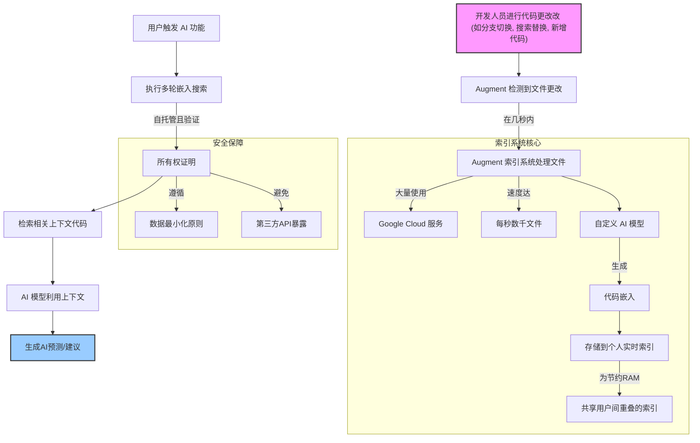

# Augment Code Codebase-Indexing

## Augment Codebase Indexing 核心流程

Augment 在代码库索引方面采取了一种独特的、以实时性、个性化和高级 AI 模型为核心的方法。其实现原理[^1] 可以总结如下：

**1.实时更新与个性化索引：**
- Augment 的核心目标是在代码更改后的**几秒钟内**完成索引更新。它认为竞争对手高达10分钟的延迟对于专业开发人员频繁切换分支的工作流来说是不足的，因为使用旧上下文的 AI 可能会导致错误或低效。
- Augment 为**每位开发人员维护一个独立的实时代码库索引**。这样可以确保 AI 始终了解用户当前正在处理的精确代码版本，尤其是在频繁进行 Git 分支切换、搜索替换或自动格式化等操作时，这些操作可能在几秒内改变数百个文件。

**2.自定义 AI 模型与上下文检索：**
- Augment 不使用通用的嵌入模型 API（例如 OpenAI）来创建代码片段嵌入。相反，它使用**自定义 AI 模型**。
- Augment 认为通用模型在处理大型代码库中的“混乱”时效果不佳，并且可能无法识别文本层面不“相似”但实际上高度相关的上下文（例如函数定义与调用点、文档与代码）。
- 其自定义模型经过专门训练，旨在识别“**最有帮助**”的上下文，并优先考虑“有用性而非相关性”。例如，对于 AI 已经熟悉的流行开源库，它不会检索其实现细节，从而优化有限的 prompt 空间。

**3.高性能与可扩展的架构：**
- Augment 的索引系统架构大量使用**Google Cloud 服务**，特别是 PubSub、BigTable 和 AI Hypercomputer，以提供高度可靠和可扩展的后端。
- 为了充分利用 GPU，其嵌入模型工作器构建在**自定义推理堆栈**上。
- 该系统目前能够以每秒处理数千个文件的速度，确保分支切换等操作能够几乎即时地被处理。
- 它还能有效地处理批量工作负载，例如新用户首次注册时的数十万文件上传，或部署新搜索索引（即新嵌入模型）时的追赶模式。通过在 PubSub 中维护单独的队列，Augment 确保即使在多个批量作业重叠时，用户也能享受到即时吞吐量。

**4.严格的安全与隐私：**
- Augment 采用“安全设计”方法，遵循数据最小化、最小权限和故障安全机制的原则。
- 它**自托管其嵌入搜索**在 Google Cloud 上，避免使用可能暴露嵌入的第三方 API，因为研究表明嵌入可以被逆向工程回源代码。
- Augment 实施了“**所有权证明**”（Proof of Possession）机制：集成开发环境（IDE）必须通过向后端发送加密哈希来证明它拥有文件的内容，然后才能从该文件中检索内容。这确保了预测严格限制在用户有权访问的数据范围内，防止敏感信息泄露。
- 为了降低成本并管理 RAM 使用，Augment 会在同一租户的用户之间共享重叠的索引部分，同时仍然保证所有权证明原则的实现。

[^1]: 实现原理：参考：[https://www.augmentcode.com/blog/a-real-time-index-for-your-codebase-secure-personal-scalable](https://www.augmentcode.com/blog/a-real-time-index-for-your-codebase-secure-personal-scalable)